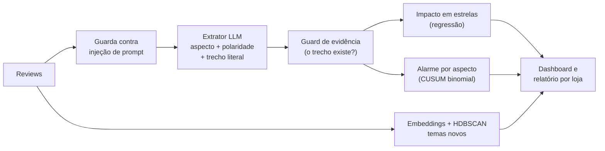

# Espelho de Reputação

Sistema de Engenharia de IA que transforma reviews de restaurantes em **dores e forças mensuráveis**, avisa quando um problema começa e mostra **quanto cada dor custa em estrelas**. Construído em 7 dias como case de portfólio, com **US$ 1,15 de API no total**.

**Página do case:** [rafhacorsini.github.io/espelho-de-reputacao](https://rafhacorsini.github.io/espelho-de-reputacao/) · **Dashboard de laboratório (Streamlit):** `uv run streamlit run app/dashboard.py`

## Resultados em 30 segundos

| O que foi medido | Resultado |
|---|---|
| Extração de aspectos no test cego (50 reviews, 64 menções) | **F1 0,94** (IC 95%: 0,90–0,99) contra **0,71** (0,63–0,80) de um baseline de palavras-chave |
| Concordância do anotador consigo mesmo (dupla rotulagem cega) | **κ = 0,90** |
| Alarme por aspecto vs. vigiar a nota média | Nos 3 problemas de uma loja, avisou em **2 a 8 dias**; a nota média levou **16 a 27 dias**. No aumento de preço na rede toda: 4 contra 6 dias. O único evento positivo (prato novo) escapou do alarme, mas foi achado pelos embeddings |
| Alarmes falsos | ~**1 por loja por mês** (2,8 por 1.000 séries-dia); validado num conjunto que o método nunca viu |
| Cascata modelo pequeno → LLM | **74% mais barata** (US$ 0,057 vs. 0,216 por 1.000 reviews) por 3 pontos de F1 |
| Temas descobertos por embeddings | Achou sozinho um evento plantado (um prato novo em uma loja) que a lista fixa de aspectos não mostraria |

## O problema

A nota média de um restaurante é um termômetro lento: quando ela cai, o problema já está lá há semanas. As reviews dizem **o quê** está errado, mas ninguém lê milhares delas. O sistema lê cada review, extrai os aspectos (atendimento, prazo de entrega, comida, preço...) com a polaridade e o trecho que prova, e transforma isso em alarme, impacto em estrelas e um relatório por loja.

## Como funciona



- **Extração:** `gpt-5.6-luna` com saída estruturada (Pydantic). Cada menção traz um trecho que o código confere, palavra por palavra, contra o texto original: 132 de 132 trechos bateram no dev.
- **Impacto:** regressão linear da nota nos aspectos, com intervalo de confiança. É associação, não causa.
- **Alarme:** CUSUM binomial por loja × aspecto, que zera e continua vigiando depois de cada alarme.
- **Temas:** embeddings (`text-embedding-3-small`) + PCA + HDBSCAN, nomes sugeridos por LLM e revisados à mão.

## Os dados, e por que são sintéticos

Não há dataset público de reviews de restaurantes brasileiros com os problemas conhecidos, e raspar o Google Maps viola os termos. A solução foi **sortear a verdade antes do texto**: para 3.555 reviews (6 lojas × 60 dias), o gerador sorteia loja, canal, aspectos, polaridade e nota, e **planta 5 eventos** (por exemplo, a demora na entrega da Loja 3 sobe de ~6% para ~30% das reviews a partir do dia 30). Só depois um LLM escreve o texto. Assim toda avaliação tem resposta certa conhecida.

**Limitação principal:** texto sintético é mais limpo que o real (menos gíria, menos ironia de verdade). Uma pesquisa de 2026 (ACL) mostra LLMs acertando ironia sintética e errando ironia humana. Por isso os números abaixo são um teto otimista, e a validação com reviews reais está no roteiro.

## Avaliação: como os números foram protegidos

1. **Gabarito humano:** 150 reviews rotuladas à mão numa ferramenta própria (`app/label_reviews.py`), divididas em dev (100) e test (50).
2. **Dev para iterar, test uma vez:** o prompt foi ajustado só no dev. O gabarito final do test foi **commitado antes** de o test ser aberto; o histórico do git prova a ordem.
3. **Dupla rotulagem cega do test:** 97% de concordância bruta, **κ = 0,90**. As divergências foram conciliadas antes de qualquer modelo ver o test.
4. **Baseline:** um dicionário de palavras-chave, escrito uma vez, sem ajuste.
5. **Intervalos por bootstrap:** com 50 reviews, 1 menção muda o F1; toda comparação traz a faixa de 95%.

| Sistema | F1 no test | IC 95% |
|---|---|---|
| `extract_v2` (oficial, escolhido antes do test) | 0,94 | 0,90–0,99 |
| `extract_v1` | 0,95 | 0,92–0,99 |
| Baseline de palavras-chave | 0,71 | 0,63–0,80 |

**Análise de erros no dev:** das 19 menções que o LLM "inventou", 10 eram coisas que o texto diz claramente e o gabarito deixou passar, 6 eram ambiguidade de regra e só 3 eram erro claro do modelo. As regras novas viraram o gabarito v2 (`data/gold/corrections_v2.json`, com o motivo de cada correção).

## O que deu errado (e o que isso ensinou)

- **Um F1 de 1,00 falso.** Depois de corrigir o gabarito olhando os erros do modelo e escrever regras no mesmo dev, o v2 fez 1,00 no dev. No test, o v2 não superou o v1 (diferença de −0,04 a +0,01). O ganho era viés de adjudicação e ajuste ao dev. O v2 continua oficial porque foi escolhido antes do test; trocar pelo v1 seria escolher olhando a prova.
- **Alarme v1: 38 alarmes falsos em 112 séries.** A aproximação normal não serve para contagens raras, e o alarme parava de vigiar depois do primeiro toque. A v2 (binomial, com reinício) foi desenhada depois de ver a v1, então foi validada num corpus novo (outra semente): 5 de 5 eventos, 3 dias de atraso médio, 1,6 alarmes falsos por 1.000 séries-dia.
- **Descobrir não é detectar.** Os embeddings descobriram o tema "risoto de camarão" (109 trechos, 100% da Loja 2, 100% depois do dia do evento plantado). Mas detectar o prato pelo centro do grupo perdia as 45 reclamações do hambúrguer, porque o centro é puxado pelos elogios, que são maioria. A detecção final é pelo nome do prato; a ferramenta mais simples ganhou.
- **Embeddings agrupam por assunto, não por sentimento.** "Preço caro" e "preço justo" caíram no mesmo grupo, e demora na entrega e espera no salão também (o texto é igual; quem separa é o canal). Por isso: agrupamento para o assunto, extrator para a polaridade.
- **Injeção de prompt: 0% não é "seguro".** Dos 40 ataques escritos à mão, só 1 funcionou sem defesa (uma ordem escondida no meio da review virou uma reclamação em elogio). O guarda marcou 40 de 40 ataques com 0 de 60 bloqueios falsos. Mas ataques ingênuos quase não funcionam em modelos de 2026, e ataques adaptativos não foram testados. A defesa principal é a contenção: o extrator não tem ferramentas nem ações, e a saída é presa a um esquema.

## Custo e escala

| Sistema | F1 no test | US$ por 1.000 reviews |
|---|---|---|
| LLM puro | 0,94 | 0,216 |
| Modelo pequeno (regressão logística sobre embeddings, destilada do LLM) | 0,81 | 0,001 |
| Cascata: o pequeno responde e manda ao LLM quando está inseguro (26% vão) | 0,91 | 0,057 |

O limiar da cascata foi escolhido no dev por uma regra fixada antes (o mais barato a até 2 pontos do LLM). Na escala deste projeto a economia é irrelevante; ela passa a importar com milhões de reviews ou quando a latência pesa (1,6 s por review no LLM). Custo total do projeto: **US$ 1,15**, detalhado por dia em `reports/dashboard_summary.json`.

## Como rodar

```bash
uv sync
uv run pytest                               # 58 testes, sem chamar API
uv run streamlit run app/dashboard.py       # dashboard (só lê arquivos versionados)
```

Para rodar etapas que chamam a API, copie `.env.example` para `.env` e coloque uma chave da OpenAI. Scripts principais, na ordem dos dias: `make_truth.py` → `generate_corpus.py` → `extract_batch.py` / `extract_corpus.py` → `evaluate.py` e `bootstrap_ci.py` → `discover_taxonomy.py` e `build_taxonomy_v1.py` → `impact_and_alarms.py` → `distill_cascade.py` e `security_eval.py` → `build_dashboard_data.py`.

## Estrutura

```
src/espelho/   extração, métricas, baseline, taxonomia, alarme, cascata, segurança
scripts/       uma etapa por script, na ordem dos dias
app/           dashboard Streamlit e ferramenta de rotulagem
site/          página pública do case (React + Vite, lê site/src/data/case.json, gerado por scripts/export_site_data.py)
data/gold/     gabarito humano (v1, v2, rodada cega e as correções com motivo)
reports/       resultados de cada etapa, em JSON e Markdown
tests/         testes de métricas, alarme, cascata, segurança e trava de regressão de qualidade
```

## Próximos passos

- Validação com ~100 reviews reais copiadas à mão (rotuladas antes de o modelo ver; só números agregados publicados).
- Red team adaptativo: um LLM atacante iterando contra o extrator.
- Testar o alarme e a regressão em dados reais, onde a causa não é conhecida.
